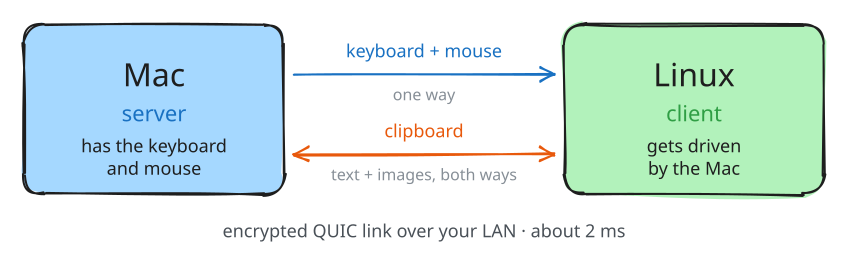
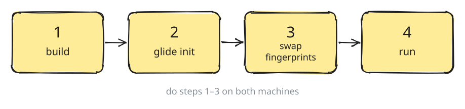
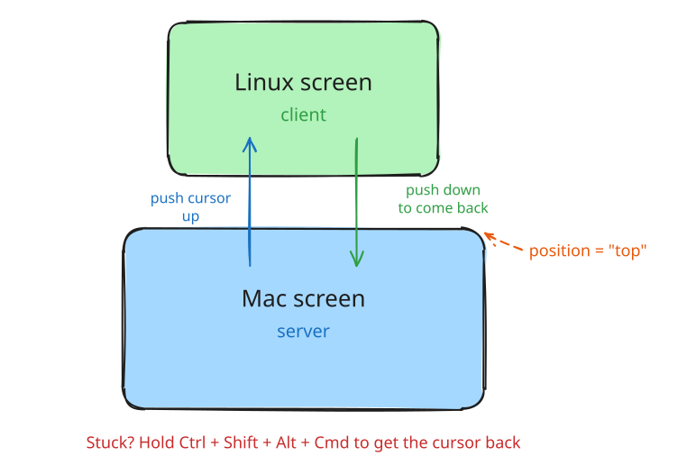
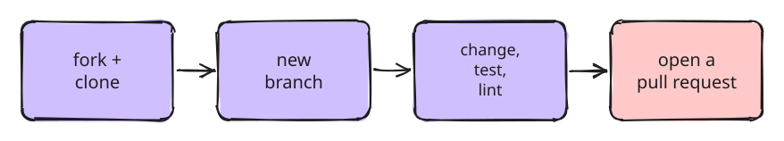

#  glide

One keyboard and mouse for your Mac and Linux box. Move the cursor off your Mac
screen and it shows up on Linux. Copy on one, paste on the other.

Inspired by [Barrier](https://github.com/debauchee/barrier) and
[lan-mouse](https://github.com/feschber/lan-mouse): Barrier does not work on
Wayland, and lan-mouse has no clipboard sync, so glide does both.



## What it does

- **Keyboard and mouse** go one way: from the Mac (server) to Linux (client).
- **Clipboard** goes both ways: text and images.
- **Fast**: about 2 ms on a wired network.
- **Safe**: the link is encrypted, and only your two machines can connect.
- Works with **macOS** and **Linux with Hyprland** (Wayland).

## Install



You need [Rust](https://rustup.rs) on both machines.

### 1. Build

```sh
git clone https://github.com/code-zenx/glide.git
cd glide
```

On **macOS**, build the app:

```sh
bash contrib/bundle.sh        # installs /Applications/Glide.app
```

On **Linux**:

```sh
cargo build --release
install -Dm755 target/release/glide ~/.local/bin/glide
```

### 2. Create a config

Run these from the `glide` folder:

```sh
./target/release/glide init --name mymac --role server    # on the Mac
./target/release/glide init --name mybox --role client    # on Linux
```

Then print each machine's fingerprint and write it down:

```sh
./target/release/glide fingerprint
```

### 3. Tell each machine about the other

Edit `~/.config/glide/config.toml` on both machines. Each one lists the *other*
machine.

On the Mac:

```toml
name = "mymac"
role = "server"

[[peer]]
name = "mybox"
addrs = ["192.168.1.50:4242"]           # the Linux box's IP
position = "top"                        # Linux sits above the Mac
fingerprint = "<fingerprint from Linux>"
```

On Linux:

```toml
name = "mybox"
role = "client"

[[peer]]
name = "mymac"
addrs = ["192.168.1.20:4242"]           # the Mac's IP
position = "bottom"                     # always the opposite side
fingerprint = "<fingerprint from the Mac>"
```

### 4. Run

**Mac:** open Glide from Applications. It does not start at login, so it only
runs when you open it. The first time, allow it in
System Settings → Privacy & Security:

- Input Monitoring
- Accessibility (called "Device Control and Data Access" on macOS 27)
- Local Network

**Linux:** start it with your Hyprland session. Copy the service file:

```sh
cp contrib/glide.service ~/.config/systemd/user/
systemctl --user daemon-reload
```

Add these two lines to `hyprland.conf`:

```
exec-once = systemctl --user import-environment WAYLAND_DISPLAY XDG_RUNTIME_DIR HYPRLAND_INSTANCE_SIGNATURE
exec-once = systemctl --user start glide.service
```

That's it. Push the cursor off the edge and it moves to the other machine.

## Arranging screens



`position` says which edge of your screen the other machine is on:
`left`, `right`, `top` or `bottom`. The two machines must use opposite sides.

If you have more than one display, add `display = 1` (or 2, 3…) to pick which
display owns the edge.

On the Mac you can also drag the screens into place: open the menu bar icon and
choose **Arrange Screens…**. The other machine is updated for you.

**Cursor stuck?** Hold `Ctrl + Shift + Alt + Cmd` together to get it back.

## Check what it is doing

On Linux:

```sh
glide status            # ● 1.8ms  or  → mymac  or  ✕ offline
glide status --json     # for waybar
```

On the Mac, the menu bar icon shows the same thing. For a waybar module, see
[contrib/waybar-glide.md](contrib/waybar-glide.md).

## Tips

- **macOS keeps asking for permissions after every rebuild?** macOS forgets
  permissions when the app's signature changes. Sign it with a certificate,
  even a self-signed one, and `contrib/bundle.sh` will use it. See the notes at
  the top of that file.
- **Images do not paste on Linux?** Another program reading the clipboard can
  cancel it. Check for stray `wl-paste --watch` processes.
- **Don't run lan-mouse at the same time.** It uses the same port and screen edges.

## Contributing



1. Fork the repo on GitHub and clone your fork.
2. Make a branch: `git checkout -b my-change`
3. Make your change, then check it:

   ```sh
   cargo build
   cargo test
   cargo clippy --all-targets
   ```

4. Commit with a short, simple message, for example `Fix cursor stuck at screen edge`.
5. Push and open a pull request. Say what you changed and why.

Good first things to work on:

- Land the cursor at the same spot on the other screen
- Swap Cmd and Super keys between macOS and Linux
- Find the other machine on the network without typing its IP

The diagrams are in `docs/images`. Open a `.excalidraw` file at
[excalidraw.com](https://excalidraw.com), edit it, and export it as SVG with the
same name.

## Credits

- [Barrier](https://github.com/debauchee/barrier) for the idea of a server and a client.
- [lan-mouse](https://github.com/feschber/lan-mouse) for the input capture and
  emulation code glide is built on.

## License

GPL-3.0, the same as the lan-mouse code it uses.
